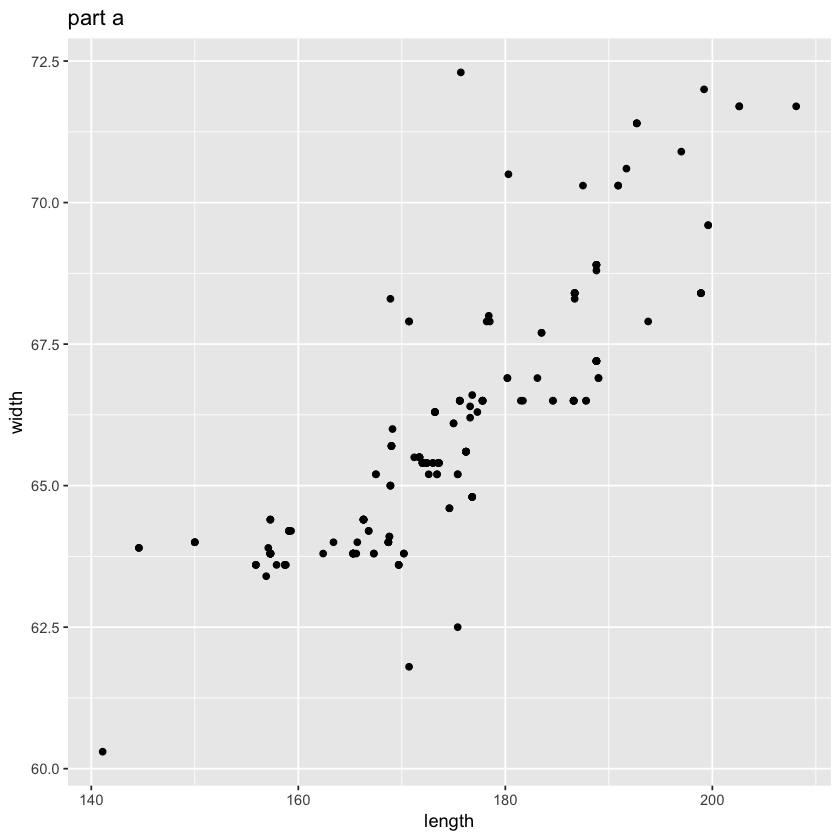
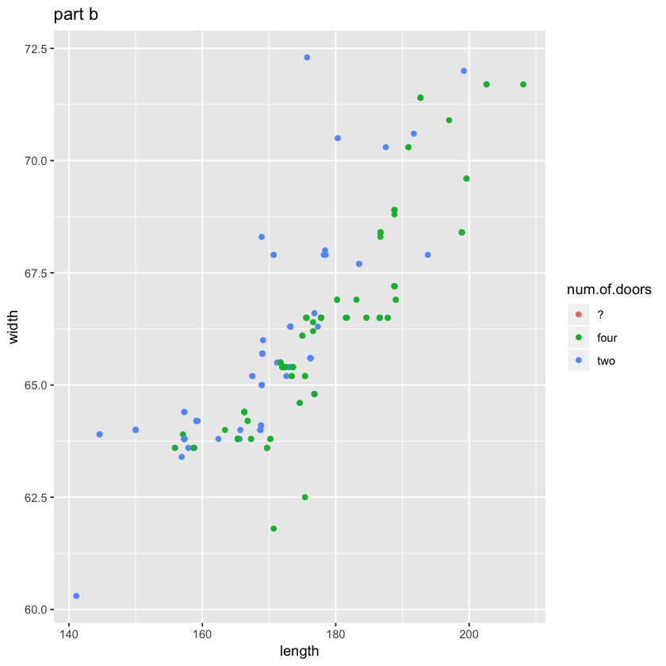
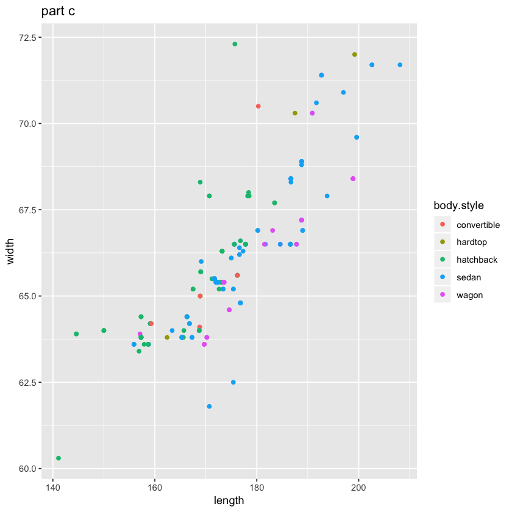
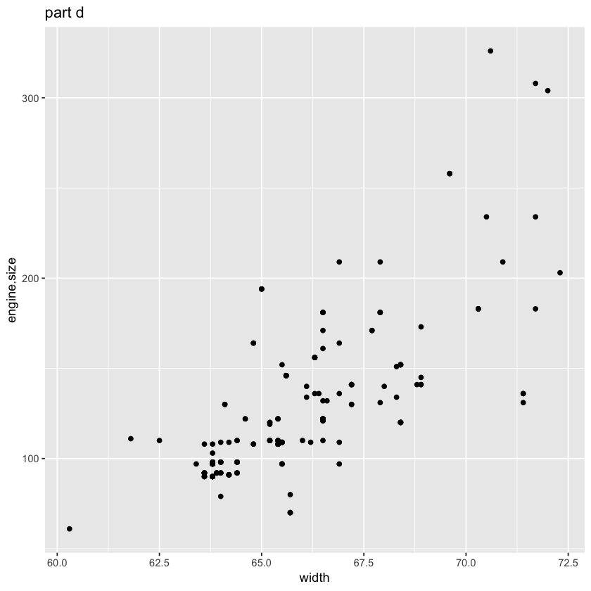
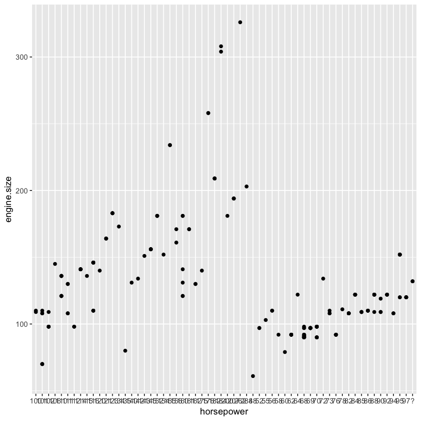
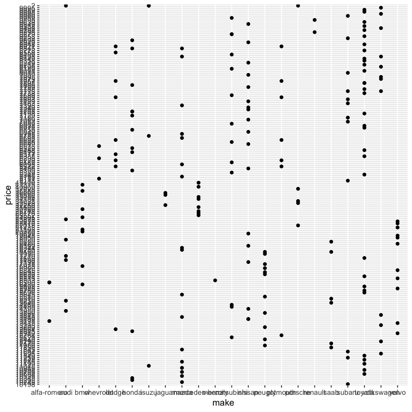
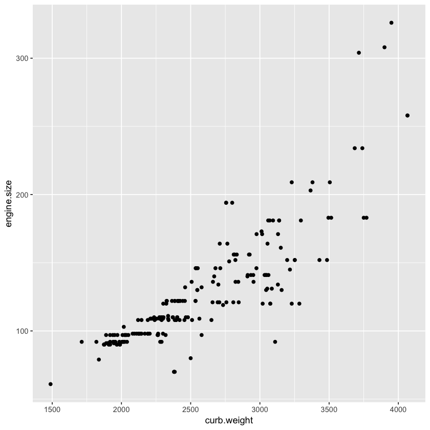
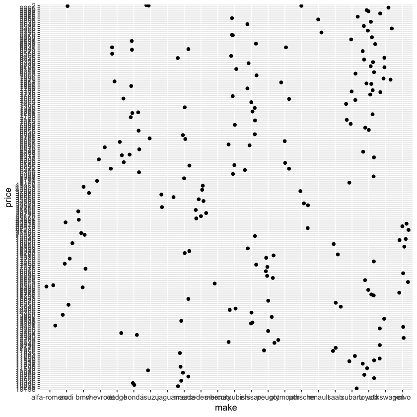

# Descriptive-Data-Analysis
Descriptive statistics analysis of an automobile dataset on Kaggle.

The dataset for this project is from the link below:

https://www.kaggle.com/toramky/automobile-dataset?select=Automobile_data.csv

Studying the following hypotheses:

A) If a car is longer, it has also greater width:

```ruby
plot1<-ggplot(data=sample)+geom_point(mapping = aes (x=length , y=width))
```


The statement is approved, since the diagram is ascending.

B) In the distribution related to the heights and widths of the cars, the points in the right side of the graph are 4-door cars.

```ruby
plot2<-ggplot(data=sample)+geom_point(mapping = aes (x=length ,  y=width , color=num.of.doors))
```



As it can be seen, these 2 parameters do not relate.

C) In the distribution related to the heights and widths of the cars, hatchback cars are more concentrated in the buttom left corner.

```ruby
plot3<-ggplot(data=sample)+geom_point(mapping = aes (x=length , y=width , color=body.style))
```



As it can be seen, the statement is almost correct.

D) The wider a car, the more resistance it shows to air force. Also it is probably heavier and has more motor power:

```ruby
plot4<-ggplot(data=sample)+geom_point(mapping = aes (x=width , y=engine.size))
```



As it can be seen, these 2 parameters have **direct** relationship.


E) Engine size and horsepower have direct relation in a car.

```ruby
ggplot(data=sample)+geom_point(mapping = aes (x=horsepower , y=engine.size))
```



As it can be seen, these 2 parameters do not have **direct** relationship.

F) Relation between the price of the cars and their brand and model.

```ruby
ggplot(data=sample)+geom_point(mapping = aes (x=make , y=price))
```



As it can be seen, the price doesn't vary much, and the plot needs to be improved.

G) Relation between weight of a car and the engine size.

```ruby
ggplot(data=sample)+geom_point(mapping = aes (x=curb.weight,y=engine.size ))
```



As it can be seen, these 2 parameters have **direct** relationship.

Applying **Jitter** to the price-make graph to better observe the distribution.

```ruby
p <- ggplot(sample, aes(make,price))
p + geom_jitter()
```



